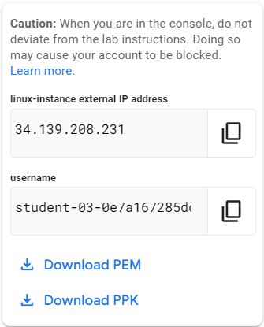
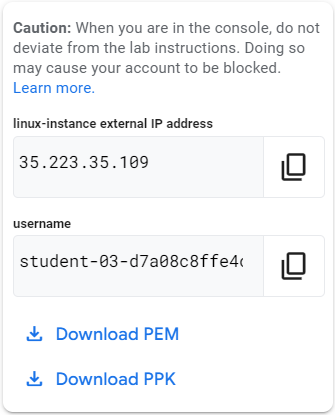

# Google IT Automation with Python Professional Certificate

Courses

1. Crash Course on Python
   - 26 hours
2. Using Python to Interact with the Operating System
   - 25 hours
3. Introduction to Git and GitHub
   - 16 hours
4. Troubleshooting and Debugging Techniques
   - 16 hours
5. Configuration Management and the Cloud
   - 14 hours
6. Automating Real-World Tasks with Python
   - 17 hours

Notes

- Course 1 images are screenshots of the problems and solutions in the graded assessments. The image files are not referenced anywhere. The text of the problems and solutions are in [solutions-crash-course-on-python.md](./course01-crash-course-on-python/solutions-crash-course-on-python.md).
- Each time we start week 2 lab in course 3, the PPK file generated will be different.
- Each time we start week 2 lab in course 3, Linux instance external IP address and username will be different. Compare  with .

