# Solutions to Problems in Introduction to Git and GitHub

## Week 1

### Course Introduction

### Before Version Control

#### Practice Quiz: Before Version Control

***Solution 01***

- [x] `patch fix_names.conf < fix_names.patch`

***Solution 02***

- [x] `diff fix_permissions.py fix_permissions_modified.py > fix_permissions.patch`

***Solution 03***

- [x] `wdiff`

***Solution 04***

- [x] Using the exit command from the sys module

***Solution 05***

- [x] Diff file

### Version Control Systems

#### Practice Quiz: Version Control Systems

***Solution 01***

Multiple answers:

- [x] Git retains local copies of repositories, resulting in fast operations.
- [x] If something breaks due to a change, you can fix the problem by reverting to a working version before the change.
- [x] Git allows you to review the history of your project.

***Solution 02***

- [x] Linus Torvalds

***Solution 03***

- [x] Version control

***Solution 04***

- [x] commit

***Solution 05***

- [x] repositories

### Using Git

#### Practice Quiz: Using Git

***Solution 01***

- [x] `git add`

***Solution 02***

- [x] `git log`

***Solution 03***

- [x] `git add`

***Solution 04***

- [x] `git config -l`

***Solution 05***

- [x] `git status`

### Module 1 Review

#### Qwiklabs Assessment: Introduction to Git

##### Introduction

In this scenario, you are a project lead in an IT company. You and your team are working on a huge project, which consists of multiple functionalities and modules. This project is evolving over time and so your team is expecting a lot of code revisions. In this lab, you'll learn how to use a distributed version control system called Git. You'll also discover how to connect to a VM instance, install Git, and configure your Git user information. Next, you'll create a local Git repository, add a file to the repository, and do some basic operations like adding a file, editing files, and making commits.

What you'll do

- Create a git repository.
- Add files to this repository
- Edit the files
- Commit the changes to the repository.

You'll have 90 minutes to complete this lab.

###### Start the lab

You'll need to start the lab before you can access the materials in the virtual machine OS. To do this, click the green “Start Lab” button at the top of the screen.

Note: For this lab you are going to access the Linux VM through your local SSH Client, and not use the Google Console (Open GCP Console button is not available for this lab).

<p align="left">
    
</p>

After you click the “Start Lab” button, you will see all the SSH connection details on the left-hand side of your screen. You should have a screen that looks like this:

<p align="center">
    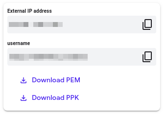
</p>

##### Accessing the virtual machine

Please find one of the three relevant options below based on your device's operating system.

Note: Working with Qwiklabs may be similar to the work you'd perform as an IT Support Specialist; you'll be interfacing with a cutting-edge technology that requires multiple steps to access, and perhaps healthy doses of patience and persistence(!). You'll also be using SSH to enter the labs -- a critical skill in IT Support that you’ll be able to practice through the labs.

###### Option 1: Windows Users: Connecting to your VM

In this section, you will use the PuTTY Secure Shell (SSH) client and your VM’s External IP address to connect.

**Download your PPK key file.**

You can download the VM’s private key file in the PuTTY-compatible PPK format from the Qwiklabs Start Lab page. Click on Download PPK.

<p align="center">
    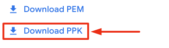
</p>

**Connect to your VM using SSH and PuTTY**

1. You can download Putty from [here](https://the.earth.li/~sgtatham/putty/latest/w64/putty.exe)

2. In the Host Name (or IP address) box, enter username@external_ip_address.

Note: Replace username and external_ip_address with values provided in the lab.

<p align="center">
    
</p>

3. In the Connection list, expand SSH.

4. Then expand Auth by clicking on + icon.

5. Now, select the Credentials from the Auth list.

6. In the Private key file for authentication box, browse to the PPK file that you downloaded and double-click it.

7. Click on the Open button.

Note: PPK file is to be imported into PuTTY tool using the Browse option available in it. It should not be opened directly but only to be used in PuTTY.

<p align="center">
    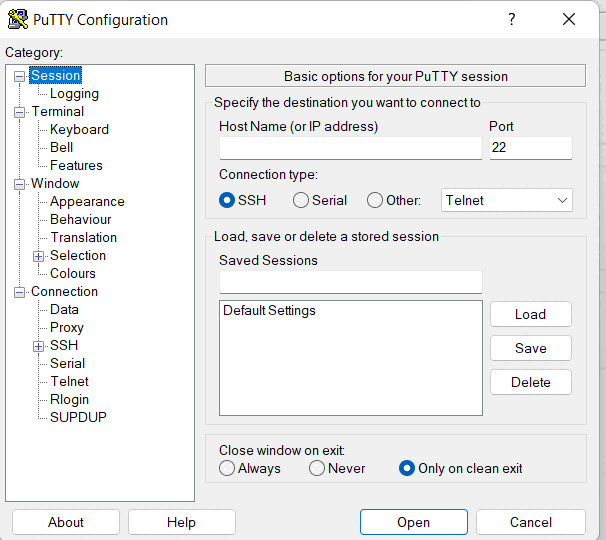
</p>

8. Click Yes when prompted to allow a first connection to this remote SSH server. Because you are using a key pair for authentication, you will not be prompted for a password.

**Common issues**

If PuTTY fails to connect to your Linux VM, verify that:

- You entered `<username>@<external ip address>` in PuTTY.
- You downloaded the fresh new PPK file for this lab from Qwiklabs.
- You are using the downloaded PPK file in PuTTY.

###### Option 2: OSX and Linux users: Connecting to your VM via SSH

**Download your VM’s private key file.**

You can download the private key file in PEM format from the Qwiklabs Start Lab page. Click on Download PEM.

<p align="center">
    
</p>

**Connect to the VM using the local Terminal application**

A terminal is a program which provides a text-based interface for typing commands. Here you will use your terminal as an SSH client to connect with lab provided Linux VM.

1. Open the Terminal application.
   - To open the terminal in Linux use the shortcut key Ctrl+Alt+t.
   - To open terminal in Mac (OSX) enter cmd + space and search for terminal.
2. Enter the following commands.

Note: Substitute the path/filename for the PEM file you downloaded, username and External IP Address.

You will most likely find the PEM file in Downloads. If you have not changed the download settings of your system, then the path of the PEM key will be ~/Downloads/qwikLABS-XXXXX.pem

```code
chmod 600 ~/Downloads/qwikLABS-XXXXX.pem
```

```code
ssh -i ~/Downloads/qwikLABS-XXXXX.pem username@External Ip Address
```

<p align="center">
    
</p>

###### Option 3: Chrome OS users: Connecting to your VM via SSH

Note: Make sure you are not in Incognito/Private mode while launching the application.

**Download your VM’s private key file.**

You can download the private key file in PEM format from the Qwiklabs Start Lab page. Click on Download PEM.

<p align="center">
    
</p>

**Connect to your VM**

1. Add Secure Shell from [here](https://chrome.google.com/webstore/detail/secure-shell/iodihamcpbpeioajjeobimgagajmlibd) to your Chrome browser.

2. Open the Secure Shell app and click on [New Connection].

<p align="center">
    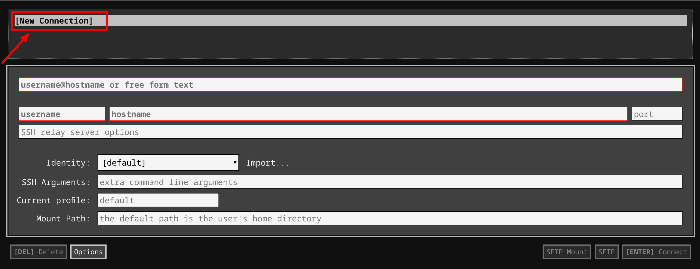
</p>

3. In the username section, enter the username given in the Connection Details Panel of the lab. And for the hostname section, enter the external IP of your VM instance that is mentioned in the Connection Details Panel of the lab.

<p align="center">
    
</p>

4. In the Identity section, import the downloaded PEM key by clicking on the Import… button beside the field. Choose your PEM key and click on the OPEN button.

Note: If the key is still not available after importing it, refresh the application, and select it from the Identity drop-down menu.

5. Once your key is uploaded, click on the [ENTER] Connect button below.

<p align="center">
    
</p>

6. For any prompts, type yes to continue.

7. You have now successfully connected to your Linux VM.

You're now ready to continue with the lab!

##### Install Git

Before you install Git on your Linux VM, you need to first make sure that you have a fresh index of the packages available to you. To do that, run:

```linux
sudo apt update
```

Now, you can install Git on your Linux host using apt by running the following command:

```linux
sudo apt install git
```

For any prompts, continue by clicking Y.

Note: Installing Git may take a couple of minutes.

Check the installed version of git by using the command below:

```git
git --version
```

Click Check my progress to verify the objective.

##### Initialize a new repository

Create a directory to store your project in. To do this, use the following command:

```linux
mkdir my-git-repo
```

Now navigate to the directory you created.

```linux
cd my-git-repo
```

Next, initialize a new repository by using the following command:

```git
git init
```

The git init command creates a new Git repository. In our case, it transformed the current directory into a Git repository. It can also be used to convert an existing, unversioned project to a Git repository or to initialize a new, empty repository.

Executing git init creates a .git subdirectory in the current working directory, which contains all of the necessary Git metadata for the new repository. This metadata includes subdirectories for objects, refs, and template files. A HEAD file is also created which points to the currently checked out commit.

If you've already run git init on a project directory containing a .git subdirectory, you can safely run git init again on the same project directory. The operation is what we call idempotent; running it again doesn't override an existing .git configuration.

##### Configure Git

Git uses a username to associate commits with an identity. It does this by using the git config command. To set Git username use the following command:

```git
git config --global user.name "Name"
```

Replace Name with your name. Any future commits you push to GitHub from the command line will now be represented by this name. You can use git config to even change the name associated with your Git commits. This will only affect future commits and won't change the name used for past commits.

Let's set your email address to associate it with your Git commits.

```git
git config --global user.email "user@example.com"
```

Replace `user@example.com` with your email-id. Any future commits you now push to GitHub will be associated with this email address. You can even use git config to change the user email associated with your Git commits.

##### Git Operations

Let's now create a text file named README. We will be using the nano editor for this.

```text
nano README
```

Type any text within the file, or you can use the following text:

```text
This is my first repository.
```

Save the file by pressing Ctrl-o, Enter key, and Ctrl-x.

Git is now aware of the files in the project. We can check the status using the following command:

```git
git status
```

This command displays the status of the working tree. It also shows changes that have been staged, changes that haven't been staged, and files that aren't tracked by Git.

<p align="center">
    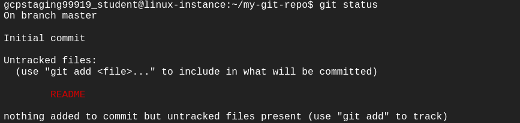
</p>

You can now see the file you created, README, under the section Untracked files. Git isn't tracking the files yet. To track the files, we have to commit these files by adding them to the staging area.

Now let's add the file to the staging area using the following command:

```git
git add README
```

This command adds changes from the working tree to the staging area i.e., it gathers and prepares files for Git before committing them. In other words, it updates the index with the current content found in the working tree to prepare the content that's staged for the next commit.

You can now view the status of the working tree using the command: git status. This now shows the file README in green i.e., the file is now in the staging area and yet to be committed.

<p align="center">
    
</p>

However, git add doesn't affect the repository in any serious way because changes are not actually recorded until you commit them.

Let's now commit the changes. A Git commit is equivalent to the term "Save".

Commit the changes using the following command:

```git
git commit
```

This now opens an editor, asking you to type a commit message. Every commit has an associated commit message. A commit message is a log message from the user describing the changes.

Enter the commit message of your choice or you can use the following text:

```text
This is my first commit!
```

Once you have entered the commit message, save it by pressing Ctrl-o and Enter key. To exit click Ctrl-x.

The git commit command captures a snapshot of the project's currently staged changes i.e., it stores the current contents of the index in a new commit along with the commit message.

Click Check my progress to verify the objective.

##### Congratulations!

Congrats! You've successfully installed the Git, initialized a repository, and performed basic Git operations. Now that you know how to do this, it will be easier for you and your team to work on a huge project with multiple functionalities and modules.

##### End your lab

When you have completed your lab, click End Lab. Qwiklabs removes the resources you’ve used and cleans the account for you.

You will be given an opportunity to rate the lab experience. Select the applicable number of stars, type a comment, and then click Submit.

The number of stars indicates the following:

- 1 star = Very dissatisfied
- 2 stars = Dissatisfied
- 3 stars = Neutral
- 4 stars = Satisfied
- 5 stars = Very satisfied

You can close the dialog box if you don't want to provide feedback.

For feedback, suggestions, or corrections, please use the Support tab.

#### My Work for Qwiklabs Assessment: Introduction to Git

1. After click [Start Lab] button, we can see Linux instance external IP address and username.

<p align="center">
    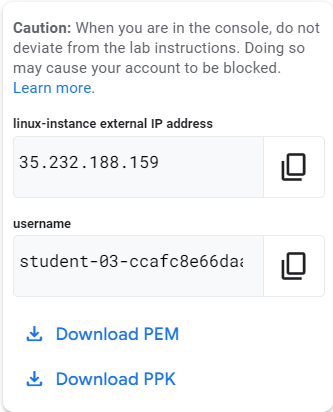
</p>

2. Fill in [Host Name]

<p align="center">
    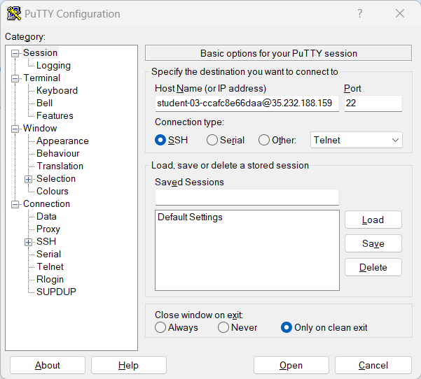
</p>

3. Open SSH Credentials

<p align="center">
    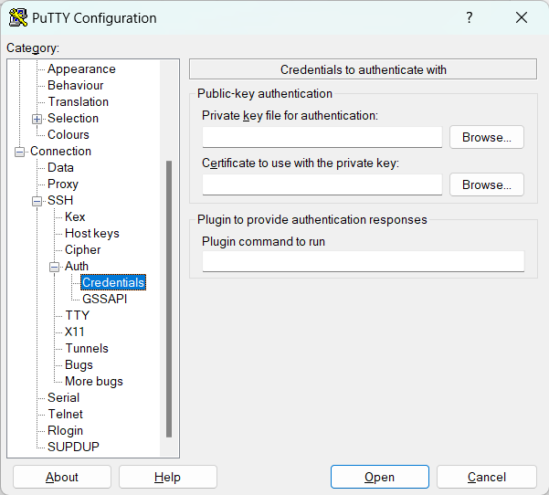
</p>

4. Import `.ppk` private key file for authentification

<p align="center">
    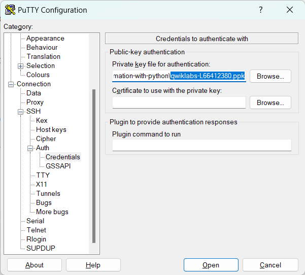
</p>

5. After clicking [Open], we will see PuTTY security alert

<p align="center">
    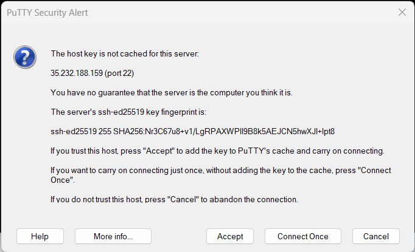
</p>

6. Upon successful connection, a Linux instance will pop up

<p align="center">
    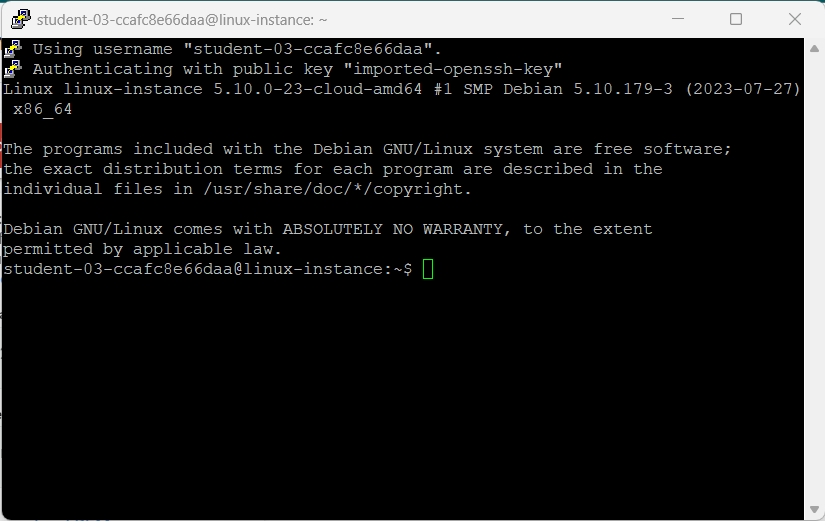
</p>

7. To keep all of our packages up to date in Linux VM, update Advanced Packaging Tool (APT) package manager

<p align="center">
    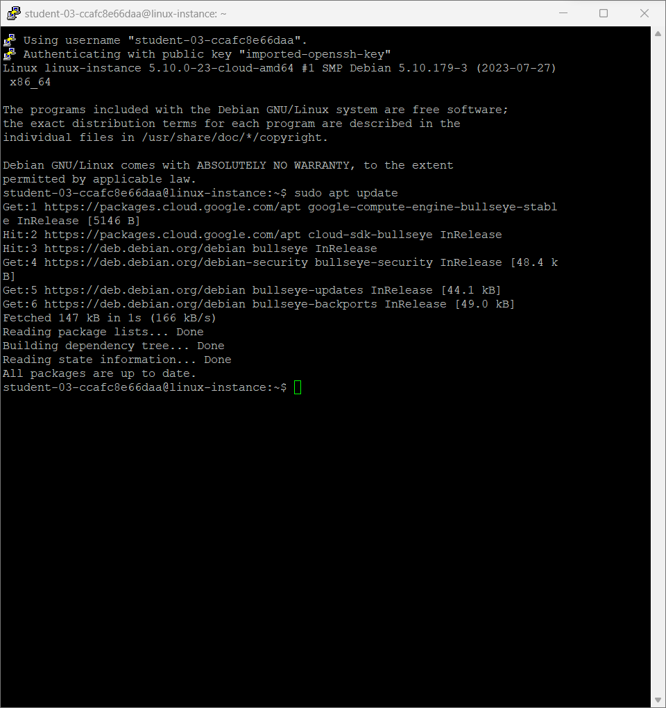
</p>

8. Use APT to install Git

<p align="center">
    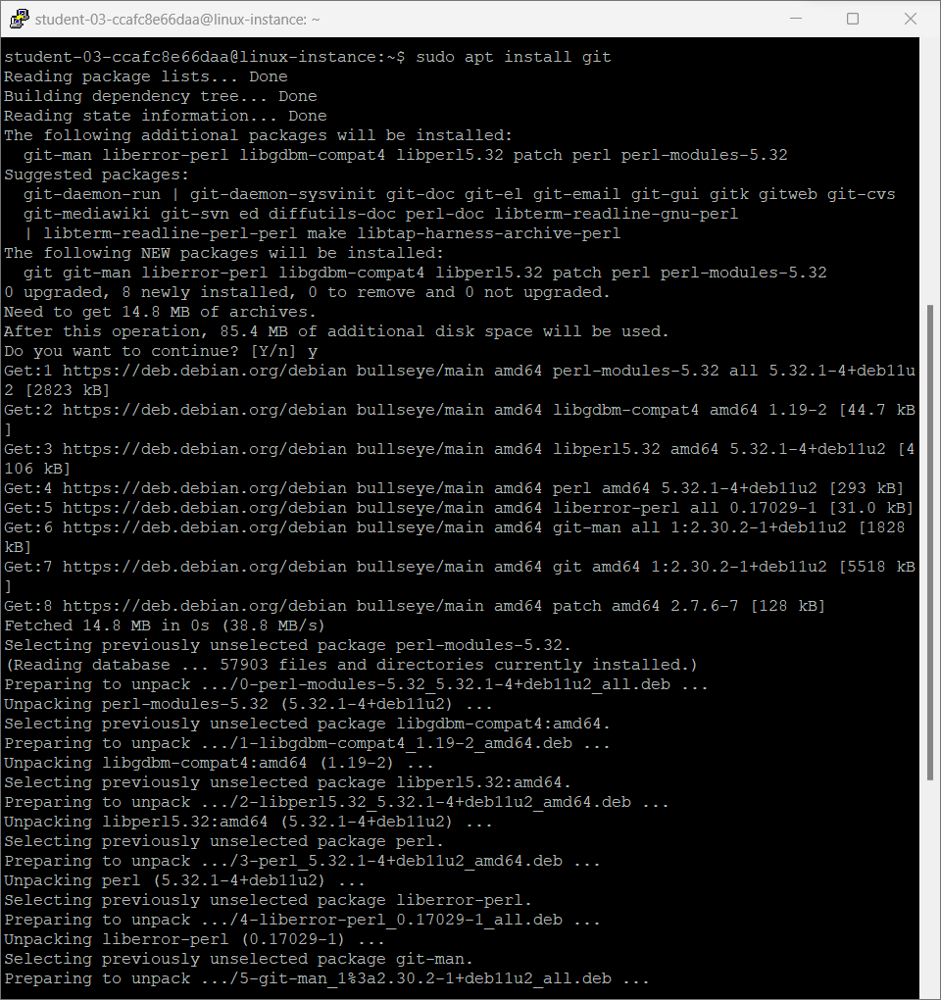
</p>

9. Check Git version

<p align="center">
    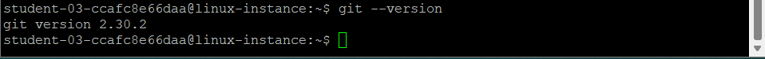
</p>

10. Check progress to see if Git is installed

<p align="center">
    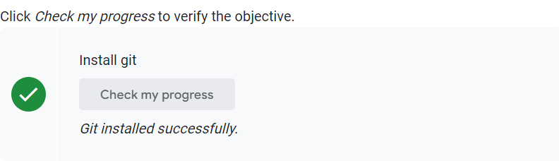
</p>

11. Initialize a new repository

<p align="center">
    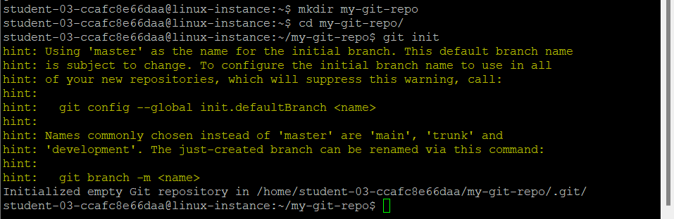
</p>

12. Configure Git

<p align="center">
    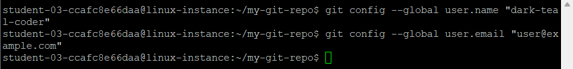
</p>

13. Create and update README file

<p align="center">
    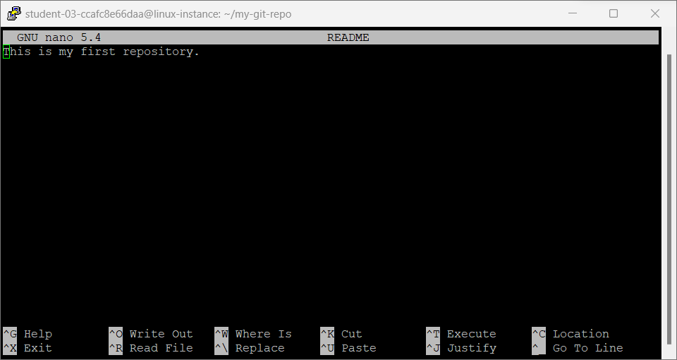
</p>

13. Check if README is created, git-add and git-commit README

<p align="center">
    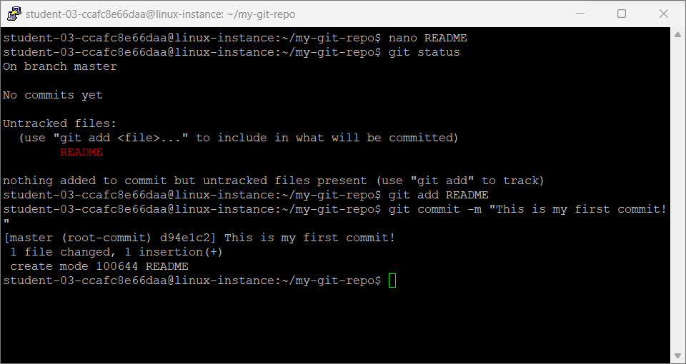
</p>

14. Check progress to see if the 1st commit is successful

<p align="center">
    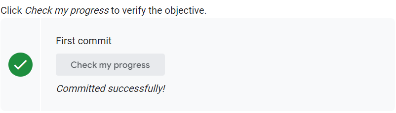
</p>

15. Update README content

<p align="center">
    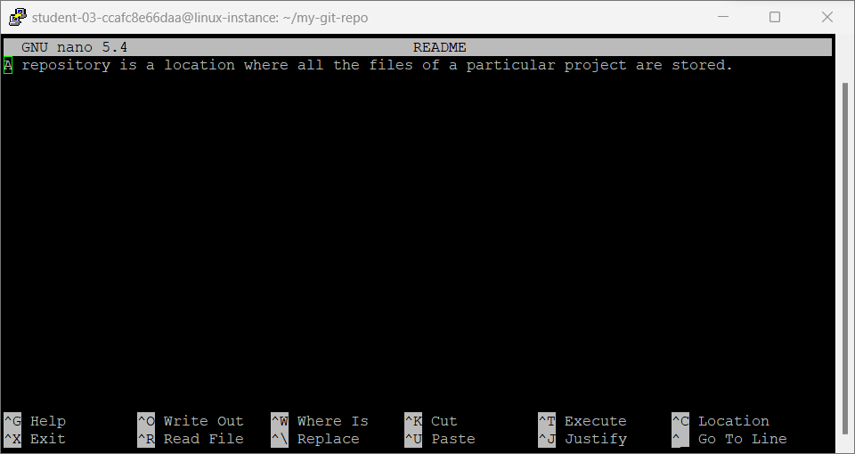
</p>

16. Check if README has been updated; see the previous and current versions of README; git-add and git-commit README again; check commit messages

<p align="center">
    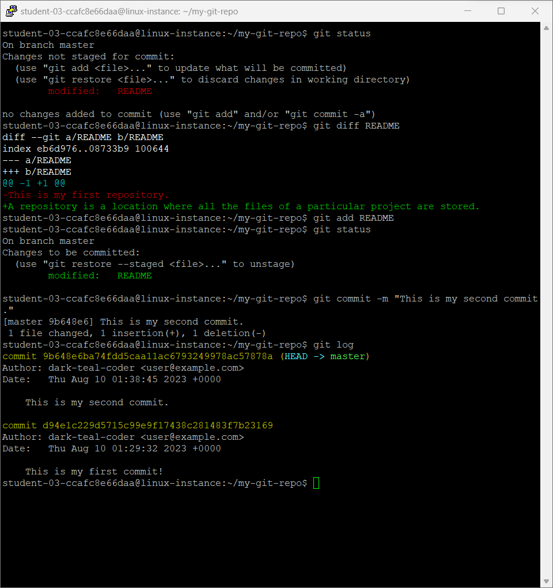
</p>

17. Check progress to see if the 2nd commit is successful

<p align="center">
    
</p>

## Week 2

### Advanced Git interaction

#### Practice Quiz: Advanced Git Interaction

***Solution 01***

- [x] `git mv`

***Solution 02***

- [x] A file containing a list of files or filename patterns for Git to skip for the current repo.

***Solution 03***

- [x] New files

***Solution 04***

- [x] The currently checked-out snapshot of your project

***Solution 05***

- [x] `--stat`

### Undoing Things

#### Practice Quiz: Undoing Things

***Solution 01***

- [x] `git revert``

***Solution 02***

- [x] use the commit ID at the end of the git revert command

***Solution 03***

- [x] To guarantee the consistency of our repository

***Solution 04***

- [x] Overwrite the previous commit

***Solution 05***

- [x] `git show`

### Branching and Merging

### Module 2 Review

#### Qwiklabs Assessment: Merging Branches in Git

##### Introduction

In this lab, you'll use your knowledge of Git and Git commit history to check out an existing repo and make some changes to it. You'll also test what you learned about rolling back commits after bad changes in order to fix a script in the repo and run it to produce the correct output.

What you'll do

- Check the status and history of an existing Git repo
- Create a branch
- Modify content on the branch
- Make rollback changes
- Merge the branch

You'll have 90 minutes to complete this lab.

###### Start the lab

You'll need to start the lab before you can access the materials in the virtual machine OS. To do this, click the green “Start Lab” button at the top of the screen.

Note: For this lab you are going to access the Linux VM through your local SSH Client, and not use the Google Console (Open GCP Console button is not available for this lab).

<p align="left">
    
</p>

After you click the “Start Lab” button, you will see all the SSH connection details on the left-hand side of your screen. You should have a screen that looks like this:

<p align="center">
    
</p>

##### Accessing the virtual machine

Please find one of the three relevant options below based on your device's operating system.

Note: Working with Qwiklabs may be similar to the work you'd perform as an IT Support Specialist; you'll be interfacing with a cutting-edge technology that requires multiple steps to access, and perhaps healthy doses of patience and persistence(!). You'll also be using SSH to enter the labs -- a critical skill in IT Support that you’ll be able to practice through the labs.

###### Option 1: Windows Users: Connecting to your VM

In this section, you will use the PuTTY Secure Shell (SSH) client and your VM’s External IP address to connect.

**Download your PPK key file.**

You can download the VM’s private key file in the PuTTY-compatible PPK format from the Qwiklabs Start Lab page. Click on Download PPK.

<p align="center">
    
</p>

**Connect to your VM using SSH and PuTTY**

1. You can download Putty from [here](https://the.earth.li/~sgtatham/putty/latest/w64/putty.exe)

2. In the Host Name (or IP address) box, enter username@external_ip_address.

Note: Replace username and external_ip_address with values provided in the lab.

<p align="center">
    
</p>

3. In the Connection list, expand SSH.

4. Then expand Auth by clicking on + icon.

5. Now, select the Credentials from the Auth list.

6. In the Private key file for authentication box, browse to the PPK file that you downloaded and double-click it.

7. Click on the Open button.

Note: PPK file is to be imported into PuTTY tool using the Browse option available in it. It should not be opened directly but only to be used in PuTTY.

<p align="center">
    
</p>

8. Click Yes when prompted to allow a first connection to this remote SSH server. Because you are using a key pair for authentication, you will not be prompted for a password.

**Common issues**

If PuTTY fails to connect to your Linux VM, verify that:

- You entered `<username>@<external ip address>` in PuTTY.
- You downloaded the fresh new PPK file for this lab from Qwiklabs.
- You are using the downloaded PPK file in PuTTY.

###### Option 2: OSX and Linux users: Connecting to your VM via SSH

**Download your VM’s private key file.**

You can download the private key file in PEM format from the Qwiklabs Start Lab page. Click on Download PEM.

<p align="center">
    
</p>

**Connect to the VM using the local Terminal application**

A terminal is a program which provides a text-based interface for typing commands. Here you will use your terminal as an SSH client to connect with lab provided Linux VM.

1. Open the Terminal application.
   - To open the terminal in Linux use the shortcut key Ctrl+Alt+t.
   - To open terminal in Mac (OSX) enter cmd + space and search for terminal.
2. Enter the following commands.

Note: Substitute the path/filename for the PEM file you downloaded, username and External IP Address.

You will most likely find the PEM file in Downloads. If you have not changed the download settings of your system, then the path of the PEM key will be ~/Downloads/qwikLABS-XXXXX.pem

```code
chmod 600 ~/Downloads/qwikLABS-XXXXX.pem
```

```code
ssh -i ~/Downloads/qwikLABS-XXXXX.pem username@External Ip Address
```

<p align="center">
    
</p>

###### Option 3: Chrome OS users: Connecting to your VM via SSH

Note: Make sure you are not in Incognito/Private mode while launching the application.

**Download your VM’s private key file.**

You can download the private key file in PEM format from the Qwiklabs Start Lab page. Click on Download PEM.

<p align="center">
    
</p>

**Connect to your VM**

1. Add Secure Shell from [here](https://chrome.google.com/webstore/detail/secure-shell/iodihamcpbpeioajjeobimgagajmlibd) to your Chrome browser.

2. Open the Secure Shell app and click on [New Connection].

<p align="center">
    
</p>

3. In the username section, enter the username given in the Connection Details Panel of the lab. And for the hostname section, enter the external IP of your VM instance that is mentioned in the Connection Details Panel of the lab.

<p align="center">
    
</p>

4. In the Identity section, import the downloaded PEM key by clicking on the Import… button beside the field. Choose your PEM key and click on the OPEN button.

Note: If the key is still not available after importing it, refresh the application, and select it from the Identity drop-down menu.

5. Once your key is uploaded, click on the [ENTER] Connect button below.

<p align="center">
    
</p>

6. For any prompts, type yes to continue.

7. You have now successfully connected to your Linux VM.

You're now ready to continue with the lab!

##### Explore repository

There is a Git repository named food-scripts consisting of a couple of food-related Python scripts.

Navigate to the repository using the following command:

```linux
cd ~/food-scripts
```

Now, list the files using the ls command. There are three files named favorite_foods.log, food_count.py, and food_question.py.

<p align="center">
    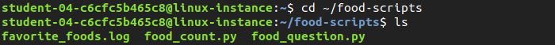
</p>

Let's explore each file. Use the cat command to view each file.

1. favorite_foods.log: This file consists of a list of food items. You can view it using the following command:

```linux
cat favorite_foods.log
```

Output:

<p align="center">
    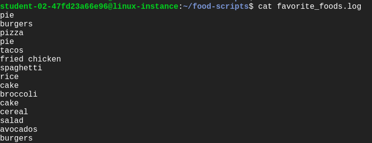
</p>

2. food_count.py: This script returns a list of each food and the number of times the food appeared in the favorite_foods.log file.

Let's execute the script food_count.py:

```linux
./food_count.py
```

Output:

<p align="center">
    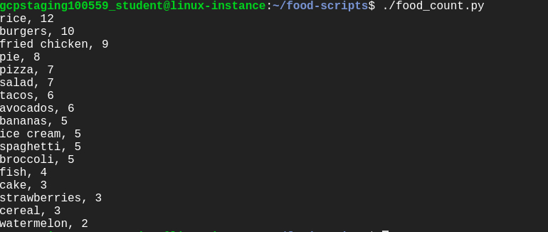
</p>

3. food_question.py: This prints a list of foods and prompts the user to enter one of those foods as their favorite. It then returns an answer of how many others in the list like that same food.

Run the following command to see the output of food_question.py script:

```linux
./food_question.py
```

Output:

<p align="center">
    
</p>

Uh oh , this gives us an error. One of your colleagues reports that this script was working fine until the most recent commit. We'll be fixing this error later during the lab.

##### Understanding the repository

Let's use the following Git operations to understand the workflow of the repository:

- git status
- git log
- git branch

Git status: This displays paths that have differences between the index file and the current HEAD commit; paths that have differences between the working tree and the index file; and paths in the working tree that are not tracked by Git. You can view the status of the working tree using the command: [git status]

```git
git status
```

You can now view the status of the working tree.

Git log: This lists the commits done in the repository in reverse chronological order; that is, the most recent commits show up first. This command lists each commit with its SHA-1 checksum, the author's name and email, date, and the commit message.

You can see logs by using the following command:

```git
git log
```

Output:

<p align="center">
    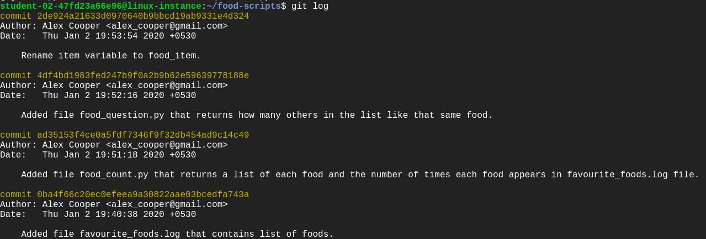
</p>

Git branch: Branches are a part of the everyday development process on the master branch. Git branches effectively function as a pointer to a snapshot of your changes. When you want to add a new feature or fix a bug, no matter how big or small, you spawn a new branch to encapsulate your changes. This makes it difficult for unstable code to get merged into the main codebase.

###### Configure Git

Before we move forward with the lab, let's configure Git. Git uses a username to associate commits with an identity. It does this by using the git config command. Set the Git username with the following command:

```git
git config user.name "Name"
```

Replace Name with your name. Any future commits you push to GitHub from the command line will now be represented by this name. You can even use git config to change the name associated with your Git commits. This will only affect future commits and won't change the name used for past commits.

Let's set your email address to associate them with your Git commits.

```git
git config user.email "user@example.com"
```

Replace user@example.com with your email-id. Any future commits you now push to GitHub will be associated with this email address. You can also use git config to change the user email associated with your Git commits.

##### Add a new feature

In this section, we'll be modifying the repository to add a new feature, without affecting the current iteration. This new feature is designed to improve the food count (from the file food_count.py) output. So, create a branch named improve-output using the following command:

```git
git branch improve-output
```

Move to the improve-output branch from the master branch.

```git
git checkout improve-output
```

Here, you can modify the script file without disturbing the existing code. Once modified and tested, you can update the master branch with a working code.

Now, open food_count.py in the nano editor using the following command:

```powershell
nano food_count.py
```

Add the line below before printing for loop in the food_count.py script:

```python
print("Favourite foods, from most popular to least popular")
```

Save the file by pressing Ctrl-o, the Enter key, and Ctrl-x. Then run the script food_count.py again to see the output:

```powershell
./food_count.py
```

Output:

<p align="center">
    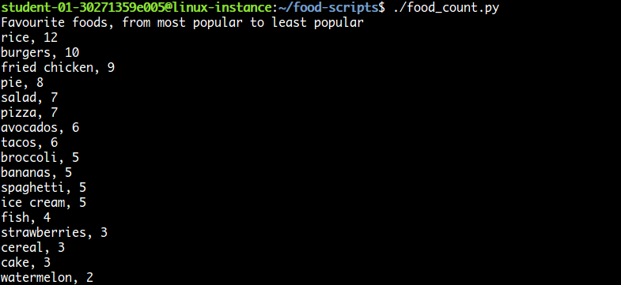
</p>

After running the food_count.py script successfully, commit the changes from the improve-output branch by adding this script to the staging area using the following command:

```git
git add food_count.py
```

Now, commit the changes you've done in the improve-output branch.

```git
git commit -m "Adding a line in the output describing the utility of food_count.py script"
```

Output:

<p align="center">
    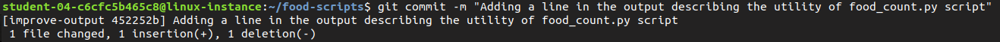
</p>

Click Check my progress to verify the objective.

##### Fix the script

In this section, we'll fix the script food_question.py, which displayed an error when executing it. You can run the file again to view the error.

```powershell
./food_question.py
```

Output:

<p align="center">
    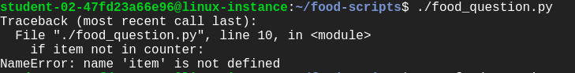
</p>

This script gives us the error: "NameError: name 'item' is not defined" but your colleague says that the file was running fine before the most recent commit they did.

In this case, we'll revert back the previous commit.

For this, check the git log history so that you can revert back to the commit where it was working fine.

```git
git log
```

Output:

<p align="center">
    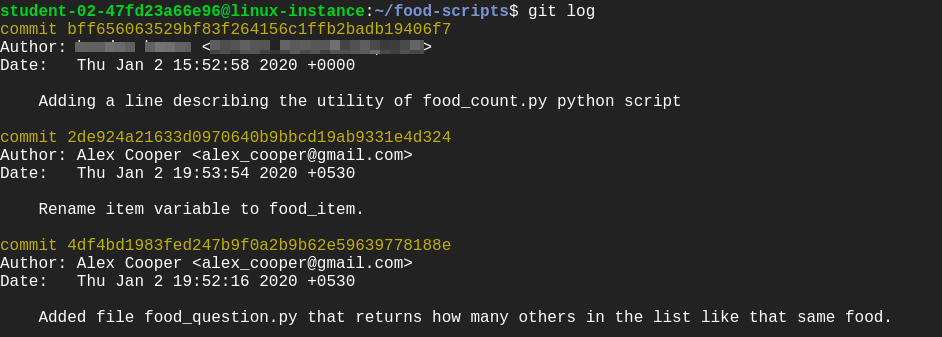
</p>

Here, you'll see the commits in reverse chronological order and find the commit having "Rename item variable to food_item" as a commit message. Make sure to note the commit ID for this particular commit.

To revert, use the following command:

```git
git revert [commit-ID]
```

Replace [commit-ID] with the commit ID you noted earlier.

This creates a new commit again. You can continue with the default commit message on the screen or add your own commit message.

Then continue by clicking Ctrl-o, the Enter key, and Ctrl-x.

Now, run food_question.py again and verify that it's working as intended.

```powershell
./food_question.py
```

Output:

<p align="center">
    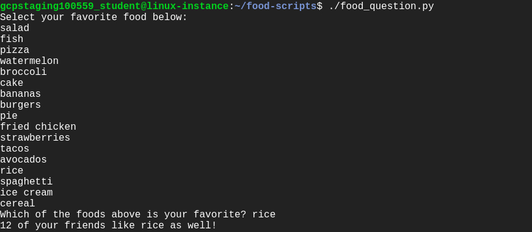
</p>

##### Merge operation

Before merging the branch improve-output, switch to the master branch from the current branch improve-output branch using the command below:

```git
git checkout master
```

Merge the branch improve-output into the master branch.

```git
git merge improve-output
```

Output:

<p align="center">
    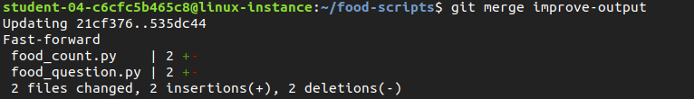
</p>

Now, all your changes made in the improve-output branch are on the master branch.

```powershell
./food_question.py
```

Output:

<p align="center">
    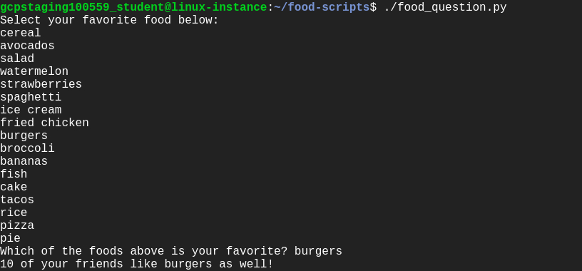
</p>

To get the status from the master branch, use the command below:

```git
git status
```

Output:

<p align="center">
    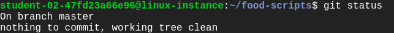
</p>

To track the git commit logs, use the following command:

```git
git log
```

Output:

<p align="center">
    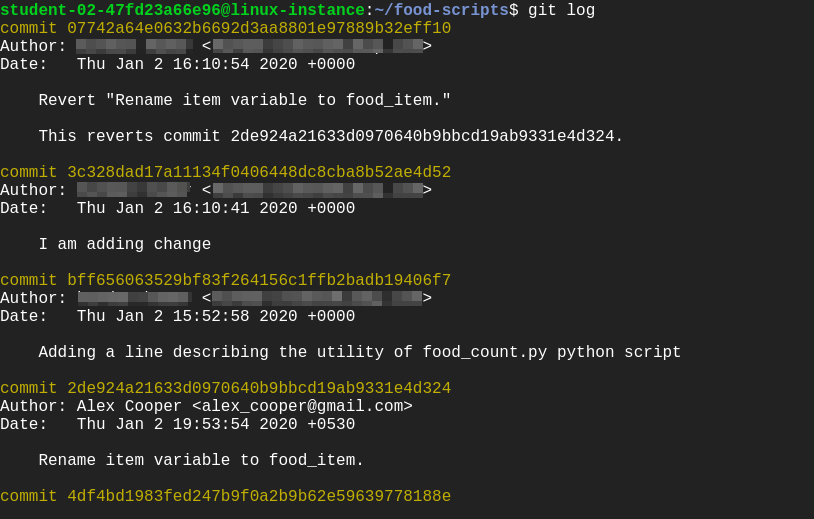
</p>

Enter `q` to exit.

Click Check my progress to verify the objective.

##### Congratulations!

In this lab, you successfully created a branch from the master branch to add a new feature. You also rolled back a commit to where the script worked fine, and then merged it to the master branch. This will help as you work with colleagues who are simultaneously on the same repository.

##### End your lab

When you have completed your lab, click End Lab. Qwiklabs removes the resources you’ve used and cleans the account for you.

You will be given an opportunity to rate the lab experience. Select the applicable number of stars, type a comment, and then click Submit.

The number of stars indicates the following:

- 1 star = Very dissatisfied
- 2 stars = Dissatisfied
- 3 stars = Neutral
- 4 stars = Satisfied
- 5 stars = Very satisfied

You can close the dialog box if you don't want to provide feedback.

For feedback, suggestions, or corrections, please use the Support tab.

## Week 3

### Introduction to GitHub

### Using a Remote Repository

### Solving Conflicts

### Module 3 Review

#### Qwiklabs Assessment: Introduction to Github

##### Introduction

In this lab, you'll practice the basics of interacting with GitHub. You'll practice setting up an account, logging in, creating a repository, making changes on the local machine, and pushing changes back to the remote repository. We use these git operations to share changes from the remote repository to the local repository and vice-versa.

What you'll do

- Create a Github account
- Create a git repository
- Git clone to create a local copy on your local machine
- Add a file to this repository
- Create snapshot/snapshots of the local repository
- Push the snapshots to the main branch

You'll have 90 minutes to complete this lab.

###### Start the lab

You'll need to start the lab before you can access the materials in the virtual machine OS. To do this, click the green “Start Lab” button at the top of the screen.

Note: For this lab you are going to access the Linux VM through your local SSH Client, and not use the Google Console (Open GCP Console button is not available for this lab).

<p align="left">
    
</p>

After you click the “Start Lab” button, you will see all the SSH connection details on the left-hand side of your screen. You should have a screen that looks like this:

<p align="center">
    
</p>

##### Accessing the virtual machine

Please find one of the three relevant options below based on your device's operating system.

Note: Working with Qwiklabs may be similar to the work you'd perform as an IT Support Specialist; you'll be interfacing with a cutting-edge technology that requires multiple steps to access, and perhaps healthy doses of patience and persistence(!). You'll also be using SSH to enter the labs -- a critical skill in IT Support that you’ll be able to practice through the labs.

###### Option 1: Windows Users: Connecting to your VM

In this section, you will use the PuTTY Secure Shell (SSH) client and your VM’s External IP address to connect.

**Download your PPK key file.**

You can download the VM’s private key file in the PuTTY-compatible PPK format from the Qwiklabs Start Lab page. Click on Download PPK.

<p align="center">
    
</p>

**Connect to your VM using SSH and PuTTY**

1. You can download Putty from [here](https://the.earth.li/~sgtatham/putty/latest/w64/putty.exe)

2. In the Host Name (or IP address) box, enter username@external_ip_address.

Note: Replace username and external_ip_address with values provided in the lab.

<p align="center">
    
</p>

3. In the Connection list, expand SSH.

4. Then expand Auth by clicking on + icon.

5. Now, select the Credentials from the Auth list.

6. In the Private key file for authentication box, browse to the PPK file that you downloaded and double-click it.

7. Click on the Open button.

Note: PPK file is to be imported into PuTTY tool using the Browse option available in it. It should not be opened directly but only to be used in PuTTY.

<p align="center">
    
</p>

8. Click Yes when prompted to allow a first connection to this remote SSH server. Because you are using a key pair for authentication, you will not be prompted for a password.

**Common issues**

If PuTTY fails to connect to your Linux VM, verify that:

- You entered `<username>@<external ip address>` in PuTTY.
- You downloaded the fresh new PPK file for this lab from Qwiklabs.
- You are using the downloaded PPK file in PuTTY.

###### Option 2: OSX and Linux users: Connecting to your VM via SSH

**Download your VM’s private key file.**

You can download the private key file in PEM format from the Qwiklabs Start Lab page. Click on Download PEM.

<p align="center">
    
</p>

**Connect to the VM using the local Terminal application**

A terminal is a program which provides a text-based interface for typing commands. Here you will use your terminal as an SSH client to connect with lab provided Linux VM.

1. Open the Terminal application.
   - To open the terminal in Linux use the shortcut key Ctrl+Alt+t.
   - To open terminal in Mac (OSX) enter cmd + space and search for terminal.
2. Enter the following commands.

Note: Substitute the path/filename for the PEM file you downloaded, username and External IP Address.

You will most likely find the PEM file in Downloads. If you have not changed the download settings of your system, then the path of the PEM key will be ~/Downloads/qwikLABS-XXXXX.pem

```code
chmod 600 ~/Downloads/qwikLABS-XXXXX.pem
```

```code
ssh -i ~/Downloads/qwikLABS-XXXXX.pem username@External Ip Address
```

<p align="center">
    
</p>

###### Option 3: Chrome OS users: Connecting to your VM via SSH

Note: Make sure you are not in Incognito/Private mode while launching the application.

**Download your VM’s private key file.**

You can download the private key file in PEM format from the Qwiklabs Start Lab page. Click on Download PEM.

<p align="center">
    
</p>

**Connect to your VM**

1. Add Secure Shell from [here](https://chrome.google.com/webstore/detail/secure-shell/iodihamcpbpeioajjeobimgagajmlibd) to your Chrome browser.

2. Open the Secure Shell app and click on [New Connection].

<p align="center">
    
</p>

3. In the username section, enter the username given in the Connection Details Panel of the lab. And for the hostname section, enter the external IP of your VM instance that is mentioned in the Connection Details Panel of the lab.

<p align="center">
    
</p>

4. In the Identity section, import the downloaded PEM key by clicking on the Import… button beside the field. Choose your PEM key and click on the OPEN button.

Note: If the key is still not available after importing it, refresh the application, and select it from the Identity drop-down menu.

5. Once your key is uploaded, click on the [ENTER] Connect button below.

<p align="center">
    
</p>

6. For any prompts, type yes to continue.

7. You have now successfully connected to your Linux VM.

You're now ready to continue with the lab!

##### Create a git repository

To create a git repository, you need to have a Github account. Follow the steps below to create a github account and a git repository:

- Open [Github](https://github.com). If you don't already have a Github account, create one by entering a username, email, and password. If you already have a Github account proceed to the next step.
- Log in to your account from the [Github](https://github.com) login page.
- Click the + sign in the top-right corner of the page and click then on New repository.

<p align="center">
    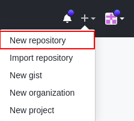
</p>

- Enter your repository name in the field Repository name and add a project description in the Description field.
- You can either select public or private to restrict repository accessibility. If public,anyone can see the repository but you still choose who can commit to it. If private, you choose who can see and commit to the repository.
- Check the option Initialize this repository with a README to initialize the repository with a README file. Leave all the other values to their default.
- Click the Create repository button.

##### Git operations

You now need to create a local copy of this remote repository on your machine. We'll do this by cloning the repository. The syntax for this is:

```git
git clone [URL]
```

For the URL, you can either choose an SSH or an HTTPS link as a URL. We will use HTTPS to clone the Git repository. Click on Clone or download and select HTTPS. Copy the HTTPS link by clicking on the Copy button beside the link.

<p align="center">
    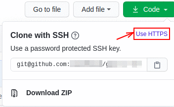
</p>

Next, go to your linux-instance terminal and replace [URL] from the above syntax with the link you copied. The command should now look similar to:

```git
git clone https://github.com/[username]/[git-repo].git
```

Here, username is the Git username and git-repo is the name of the remote repository you created.

Note: If you are using a private repo, then you will need to use your Github username and personal access token to clone the repo via HTTPS method as password authentication method is currently not supported by Github.

It requires the use of personal access tokens rather than traditional passwords so it is necessary for you to create a personal access token to complete the lab (in case you don’t have one). Also this token will be used in further steps for the lab.

Generating a Personal Access Token

Personal Access Token can be created by moving the application settings of your Github account. Proceed to the Settings menu and choose Developer settings, where you will locate the option for Personal Access Token. By utilizing this token, you will be enabled to clone and push to your remote repository using HTTPS. For more help to generate a personal access token, click [here](https://docs.github.com/en/authentication/keeping-your-account-and-data-secure/managing-your-personal-access-tokens#creating-a-token).

This creates a directory with the same name as your repository, initializes a .git directory inside it, pulls down all the data for that repository, and creates a working copy of the latest version.

You can now list the files using the ls command and find your new repository. Move into your repository using cd command. There, you'll see the project files, which are ready to be worked on or used.

```cmd
cd directory_name
```

Replace the directory_name with your repository's name that you just initialized.

If you want to clone the repository into another directory of your choice, you can do that by passing the name of the directory. This automatically creates a new directory with the specified name and initializes the repository inside it.

Syntax:

```git
git clone [URL] directory_name
```

##### Configure Git

Git uses a username to associate commits with an identity. It does this by using the git config command. Set Git username with the following command:

```git
git config --global user.name "Name"
```

Replace Name with your name. Any future commits you push to GitHub from the command line will now be represented by this name. You can use git config to even change the name associated with your Git commits. This will only affect future commits and won't change the name used for past commits.

Let's set your email address to associate them with your Git commits.

```git
git config --global user.email "user@example.com"
```

Replace user@example.com with your email-id. Any future commits you now push to GitHub will be associated with this email address. You can also use git config to even change the user email associated with your Git commits.

##### Edit the file and add it to the repository

Now, edit the README file by using nano editor:

```powershell
nano README.md
```

Add any text within the file, or you can use the following text:

```text
I am editing the README file. Adding some more details about the project description.
```

Save the file by pressing Ctrl-o, Enter key, and Ctrl-x.

We can check the status using the following command:

```git
git status
```

The git status command shows the different states of files in your working directory and staging area, like files that are modified but unstaged and files that are staged but not yet committed.

You can now see that the README.md file shows that it's been modified.

<p align="center">
    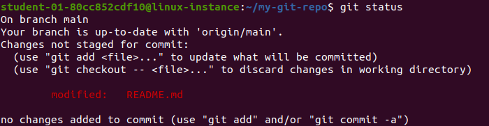
</p>

Now, let's add the file to the staging area using the following command:

```git
git add README.md
```

Use the git add command to add content from the working directory into the staging area for the next commit. When the git commit command is run, it looks at this staging area. So you can use git add to craft what you'd like your next commit snapshot to look like. To check the files in staging area use `git status``.

<p align="center">
    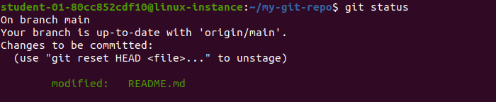
</p>

Let's now commit the changes. A Git commit is like "saving" your work.

Commit the changes using the following command:

```git
git commit
```

This now opens an editor that asks you to type a commit message. Every commit has an associated commit message. A commit message is a log message from the user describing the changes.

Enter the commit message of your choice or you can use the following text:

```text
I am editing the README file.
```

Once you've entered the commit message, save it by clicking Ctrl-o and the Enter key. To exit click Ctrl-x.

The git commit command captures a snapshot of the project's currently staged changes. It stores the current contents of the index in a new commit along with the commit message.

You've successfully committed your file!

Now, push the committed changes from your local repository to a remote repository on the main branch by using:

```git
git push origin main
```

Next, enter your Github username/email ID and personal access token on password prompt to push the changes on the associated remote repository.

Note: If you have cloned a private repository, you would have already generated a personal access token. Therefore, utilize that token to push the changes. In case you are using public repo, please refer to the steps for Generating a Personal Access Token provided earlier in the section Git operations.

Click Check my progress to verify the objective.

You can check the changes made to the local README.md file on the remote repository on [Github](https://github.com). You can see the last time when the README.md file was added/updated.

You can also see the commit ID just above the list of files in the repository. Click on the Commit ID to get more details related to the commit.

<p align="center">
    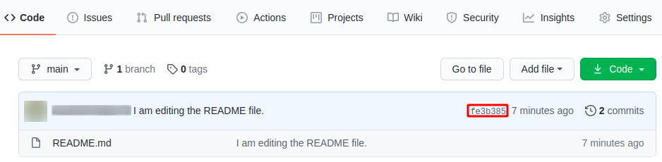
</p>

##### Create a new file and commit it to the repository

You now need to create a new file example.py on the local git repository in the working directory. To do this, use the following command:

```git
nano example.py
```

Add the following Python script to the example.py file:

```python
def git_opeation():
    print("I am adding example.py file to the remote repository.")
git_opeation()
```

Save the file by pressing Ctrl-o, Enter key, and Ctrl-x.

Now, repeat the same procedure by adding a file to the staging area for next commit:

```git
git add example.py
```

Commit the changes:

```git
git commit
```

Enter a commit message and save it by pressing Ctrl-o and the Enter key. To exit click Ctrl-x.

We will push these changes later in the lab.

Click Check my progress to verify the objective.

##### Add an empty file to the repository through web UI

Now, let's create an empty file on the remote repository using the Github website.

1. Go to your repository on the Github website and click on the Add file button, then click on Create new file. This will open a new page.

<p align="center">
    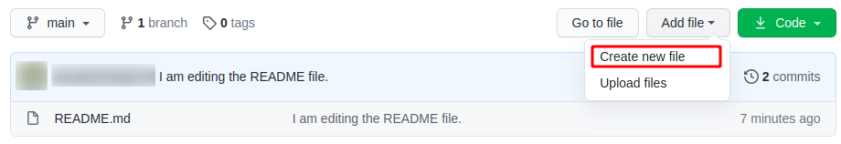
</p>

2. Enter the file's name in the box beside your repository's name. Leave the contents of the file empty.

3. Scroll down and enter a commit message in the first box under Commit new file section.

4. Leave the rest on its default value and click the Commit new file button.

You've successfully committed a new file through the website.

Now, let's push the changes made on the local repository that weren't pushed. Switch back to your terminal and enter the following command:

```git
git push origin main
```

Output:

<p align="center">
    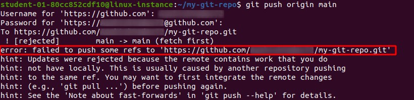
</p>

The last command throws an error. This is because the files added or change done on a remote repository (the Github website) isn't present yet on your local repository, but we're trying to push something from the local repository to the remote repository. To push changes from the local repository, we need to first update the local repository from the remote repository.

Let's now pull the current snapshot/commit in the remote repository to the local repository:

```git
git pull origin main
```

This opens an editor that asks you to enter a commit message for the merge operation (remote repository to local repository).

You can simply accept the default message or type your own message. To continue, save the file by pressing Ctrl-o, Enter key, and Ctrl-x.

The git pull command is used to fetch and download content from a remote repository and update the local repository to match that content.

Output:

<p align="center">
    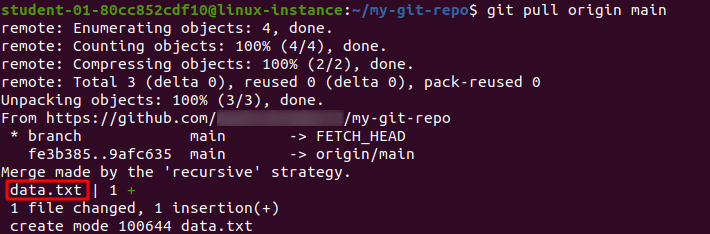
</p>

Now try pushing the changes again.

```git
git push origin main
```

Output:

<p align="center">
    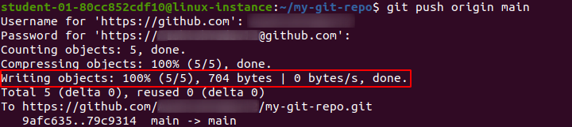
</p>

This shows that your local repository is now up-to-date with your remote repository and you successfully pushed the changes to the remote repository.

Click Check my progress to verify the objective.

##### Congratulations!

Great job! You've successfully set up a Github account, logged in, created a repository, made changes on the local machine, and pushed changes back to the remote repository. You've learned how to share local changes from a local to remote repository and vice-versa. These skills will help you as an IT specialist to work with a remote user on the same repository.

##### End your lab

When you have completed your lab, click End Lab. Qwiklabs removes the resources you’ve used and cleans the account for you.

You will be given an opportunity to rate the lab experience. Select the applicable number of stars, type a comment, and then click Submit.

The number of stars indicates the following:

- 1 star = Very dissatisfied
- 2 stars = Dissatisfied
- 3 stars = Neutral
- 4 stars = Satisfied
- 5 stars = Very satisfied

You can close the dialog box if you don't want to provide feedback.

For feedback, suggestions, or corrections, please use the Support tab.

## Week 4

### Pull Requests

### Code Reviews

### Managing Projects

### Module 4 Review

#### Qwiklabs Assessment: Pushing Local Commits to Github

##### Introduction

##### Accessing the virtual machine

##### Forking and detect function behavior

##### Configure Git

##### Fix the script

##### Commit the changes

##### Push changes

##### Congratulations!

##### End your lab

When you have completed your lab, click End Lab. Qwiklabs removes the resources you’ve used and cleans the account for you.

You will be given an opportunity to rate the lab experience. Select the applicable number of stars, type a comment, and then click Submit.

The number of stars indicates the following:

- 1 star = Very dissatisfied
- 2 stars = Dissatisfied
- 3 stars = Neutral
- 4 stars = Satisfied
- 5 stars = Very satisfied

You can close the dialog box if you don't want to provide feedback.

For feedback, suggestions, or corrections, please use the Support tab.

### Course Wrap Up
