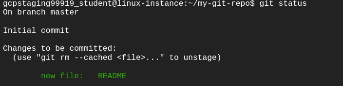

# Solutions to Problems in Introduction to Git and GitHub

## Week 1

### Course Introduction

### Before Version Control

#### Practice Quiz: Before Version Control

***Solution 01***

- [x] `patch fix_names.conf < fix_names.patch`

***Solution 02***

- [x] `diff fix_permissions.py fix_permissions_modified.py > fix_permissions.patch`

***Solution 03***

- [x] `wdiff`

***Solution 04***

- [x] Using the exit command from the sys module

***Solution 05***

- [x] Diff file

### Version Control Systems

#### Practice Quiz: Version Control Systems

***Solution 01***

Multiple answers:

- [x] Git retains local copies of repositories, resulting in fast operations.
- [x] If something breaks due to a change, you can fix the problem by reverting to a working version before the change.
- [x] Git allows you to review the history of your project.

***Solution 02***

- [x] Linus Torvalds

***Solution 03***

- [x] Version control

***Solution 04***

- [x] commit

***Solution 05***

- [x] repositories

### Using Git

#### Practice Quiz: Using Git

***Solution 01***

- [x] `git add`

***Solution 02***

- [x] `git log`

***Solution 03***

- [x] `git add`

***Solution 04***

- [x] `git config -l`

***Solution 05***

- [x] `git status`

### Module 1 Review

#### Qwiklabs Assessment: Introduction to Git

##### Introduction

In this scenario, you are a project lead in an IT company. You and your team are working on a huge project, which consists of multiple functionalities and modules. This project is evolving over time and so your team is expecting a lot of code revisions. In this lab, you'll learn how to use a distributed version control system called Git. You'll also discover how to connect to a VM instance, install Git, and configure your Git user information. Next, you'll create a local Git repository, add a file to the repository, and do some basic operations like adding a file, editing files, and making commits.

What you'll do

- Create a git repository.
- Add files to this repository
- Edit the files
- Commit the changes to the repository.

You'll have 90 minutes to complete this lab.

###### Start the lab

You'll need to start the lab before you can access the materials in the virtual machine OS. To do this, click the green “Start Lab” button at the top of the screen.

<p align="left">
    
</p>

Note: For this lab you are going to access the Linux VM through your local SSH Client, and not use the Google Console (Open GCP Console button is not available for this lab).

After you click the “Start Lab” button, you will see all the SSH connection details on the left-hand side of your screen. You should have a screen that looks like this:

<p align="center">
    
</p>

##### Accessing the virtual machine

Please find one of the three relevant options below based on your device's operating system.

Note: Working with Qwiklabs may be similar to the work you'd perform as an IT Support Specialist; you'll be interfacing with a cutting-edge technology that requires multiple steps to access, and perhaps healthy doses of patience and persistence(!). You'll also be using SSH to enter the labs -- a critical skill in IT Support that you’ll be able to practice through the labs.

###### Option 1: Windows Users: Connecting to your VM

In this section, you will use the PuTTY Secure Shell (SSH) client and your VM’s External IP address to connect.

**Download your PPK key file.**

You can download the VM’s private key file in the PuTTY-compatible PPK format from the Qwiklabs Start Lab page. Click on Download PPK.

<p align="center">
    
</p>

**Connect to your VM using SSH and PuTTY**

1. You can download Putty from [here](https://the.earth.li/~sgtatham/putty/latest/w64/putty.exe)

2. In the Host Name (or IP address) box, enter username@external_ip_address.

Note: Replace username and external_ip_address with values provided in the lab.

<p align="center">
    
</p>

3. In the Connection list, expand SSH.

4. Then expand Auth by clicking on + icon.

5. Now, select the Credentials from the Auth list.

6. In the Private key file for authentication box, browse to the PPK file that you downloaded and double-click it.

7. Click on the Open button.

Note: PPK file is to be imported into PuTTY tool using the Browse option available in it. It should not be opened directly but only to be used in PuTTY.

<p align="center">
    
</p>

8. Click Yes when prompted to allow a first connection to this remote SSH server. Because you are using a key pair for authentication, you will not be prompted for a password.

**Common issues**

If PuTTY fails to connect to your Linux VM, verify that:

- You entered `<username>@<external ip address>` in PuTTY.
- You downloaded the fresh new PPK file for this lab from Qwiklabs.
- You are using the downloaded PPK file in PuTTY.

###### Option 2: OSX and Linux users: Connecting to your VM via SSH

**Download your VM’s private key file.**

You can download the private key file in PEM format from the Qwiklabs Start Lab page. Click on Download PEM.

<p align="center">
    
</p>

**Connect to the VM using the local Terminal application**

A terminal is a program which provides a text-based interface for typing commands. Here you will use your terminal as an SSH client to connect with lab provided Linux VM.

1. Open the Terminal application.
   - To open the terminal in Linux use the shortcut key Ctrl+Alt+t.
   - To open terminal in Mac (OSX) enter cmd + space and search for terminal.
2. Enter the following commands.

Note: Substitute the path/filename for the PEM file you downloaded, username and External IP Address.

You will most likely find the PEM file in Downloads. If you have not changed the download settings of your system, then the path of the PEM key will be ~/Downloads/qwikLABS-XXXXX.pem

```code
chmod 600 ~/Downloads/qwikLABS-XXXXX.pem
```

```code
ssh -i ~/Downloads/qwikLABS-XXXXX.pem username@External Ip Address
```

<p align="center">
    
</p>

###### Option 3: Chrome OS users: Connecting to your VM via SSH

Note: Make sure you are not in Incognito/Private mode while launching the application.

**Download your VM’s private key file.**

You can download the private key file in PEM format from the Qwiklabs Start Lab page. Click on Download PEM.

<p align="center">
    
</p>

**Connect to your VM**

1. Add Secure Shell from [here](https://chrome.google.com/webstore/detail/secure-shell/iodihamcpbpeioajjeobimgagajmlibd) to your Chrome browser.

2. Open the Secure Shell app and click on [New Connection].

<p align="center">
    
</p>

3. In the username section, enter the username given in the Connection Details Panel of the lab. And for the hostname section, enter the external IP of your VM instance that is mentioned in the Connection Details Panel of the lab.

<p align="center">
    
</p>

4. In the Identity section, import the downloaded PEM key by clicking on the Import… button beside the field. Choose your PEM key and click on the OPEN button.

Note: If the key is still not available after importing it, refresh the application, and select it from the Identity drop-down menu.

5. Once your key is uploaded, click on the [ENTER] Connect button below.

<p align="center">
    
</p>

6. For any prompts, type yes to continue.

7. You have now successfully connected to your Linux VM.

You're now ready to continue with the lab!

##### Install Git

Before you install Git on your Linux VM, you need to first make sure that you have a fresh index of the packages available to you. To do that, run:

```linux
sudo apt update
```

Now, you can install Git on your Linux host using apt by running the following command:

```linux
sudo apt install git
```

For any prompts, continue by clicking Y.

Note: Installing Git may take a couple of minutes.

Check the installed version of git by using the command below:

```git
git --version
```

Click Check my progress to verify the objective.

##### Initialize a new repository

Create a directory to store your project in. To do this, use the following command:

```linux
mkdir my-git-repo
```

Now navigate to the directory you created.

```linux
cd my-git-repo
```

Next, initialize a new repository by using the following command:

```git
git init
```

The git init command creates a new Git repository. In our case, it transformed the current directory into a Git repository. It can also be used to convert an existing, unversioned project to a Git repository or to initialize a new, empty repository.

Executing git init creates a .git subdirectory in the current working directory, which contains all of the necessary Git metadata for the new repository. This metadata includes subdirectories for objects, refs, and template files. A HEAD file is also created which points to the currently checked out commit.

If you've already run git init on a project directory containing a .git subdirectory, you can safely run git init again on the same project directory. The operation is what we call idempotent; running it again doesn't override an existing .git configuration.

##### Configure Git

Git uses a username to associate commits with an identity. It does this by using the git config command. To set Git username use the following command:

```git
git config --global user.name "Name"
```

Replace Name with your name. Any future commits you push to GitHub from the command line will now be represented by this name. You can use git config to even change the name associated with your Git commits. This will only affect future commits and won't change the name used for past commits.

Let's set your email address to associate it with your Git commits.

```git
git config --global user.email "user@example.com"
```

Replace `user@example.com` with your email-id. Any future commits you now push to GitHub will be associated with this email address. You can even use git config to change the user email associated with your Git commits.

##### Git Operations

Let's now create a text file named README. We will be using the nano editor for this.

```text
nano README
```

Type any text within the file, or you can use the following text:

```text
This is my first repository.
```

Save the file by pressing Ctrl-o, Enter key, and Ctrl-x.

Git is now aware of the files in the project. We can check the status using the following command:

```git
git status
```

This command displays the status of the working tree. It also shows changes that have been staged, changes that haven't been staged, and files that aren't tracked by Git.

<p align="center">
    
</p>

You can now see the file you created, README, under the section Untracked files. Git isn't tracking the files yet. To track the files, we have to commit these files by adding them to the staging area.

Now let's add the file to the staging area using the following command:

```git
git add README
```

This command adds changes from the working tree to the staging area i.e., it gathers and prepares files for Git before committing them. In other words, it updates the index with the current content found in the working tree to prepare the content that's staged for the next commit.

You can now view the status of the working tree using the command: git status. This now shows the file README in green i.e., the file is now in the staging area and yet to be committed.

<p align="center">
    
</p>

However, git add doesn't affect the repository in any serious way because changes are not actually recorded until you commit them.

Let's now commit the changes. A Git commit is equivalent to the term "Save".

Commit the changes using the following command:

```git
git commit
```

This now opens an editor, asking you to type a commit message. Every commit has an associated commit message. A commit message is a log message from the user describing the changes.

Enter the commit message of your choice or you can use the following text:

```text
This is my first commit!
```

Once you have entered the commit message, save it by pressing Ctrl-o and Enter key. To exit click Ctrl-x.

The git commit command captures a snapshot of the project's currently staged changes i.e., it stores the current contents of the index in a new commit along with the commit message.

Click Check my progress to verify the objective.

##### Congratulations!

Congrats! You've successfully installed the Git, initialized a repository, and performed basic Git operations. Now that you know how to do this, it will be easier for you and your team to work on a huge project with multiple functionalities and modules.

##### End your lab

When you have completed your lab, click End Lab. Qwiklabs removes the resources you’ve used and cleans the account for you.

You will be given an opportunity to rate the lab experience. Select the applicable number of stars, type a comment, and then click Submit.

The number of stars indicates the following:

- 1 star = Very dissatisfied
- 2 stars = Dissatisfied
- 3 stars = Neutral
- 4 stars = Satisfied
- 5 stars = Very satisfied

You can close the dialog box if you don't want to provide feedback.

For feedback, suggestions, or corrections, please use the Support tab.

## Week 2

### Advanced Git interaction

#### Practice Quiz: Advanced Git Interaction

***Solution 01***

- [x] `git mv`

***Solution 02***

- [x] A file containing a list of files or filename patterns for Git to skip for the current repo.

***Solution 03***

- [x] New files

***Solution 04***

- [x] The currently checked-out snapshot of your project

***Solution 05***

- [x] `--stat`

### Undoing Things

#### Practice Quiz: Undoing Things

***Solution 01***

- [x] `git revert``

***Solution 02***

- [x] use the commit ID at the end of the git revert command

***Solution 03***

- [x] To guarantee the consistency of our repository

***Solution 04***

- [x] Overwrite the previous commit

***Solution 05***

- [x] `git show`

### Branching and Merging

### Module 2 Review

## Week 3

### Introduction to GitHub

### Using a Remote Repository

### Solving Conflicts

### Module 3 Review

## Week 4

### Pull Requests

### Code Reviews

### Managing Projects

### Module 4 Review

### Course Wrap Up
